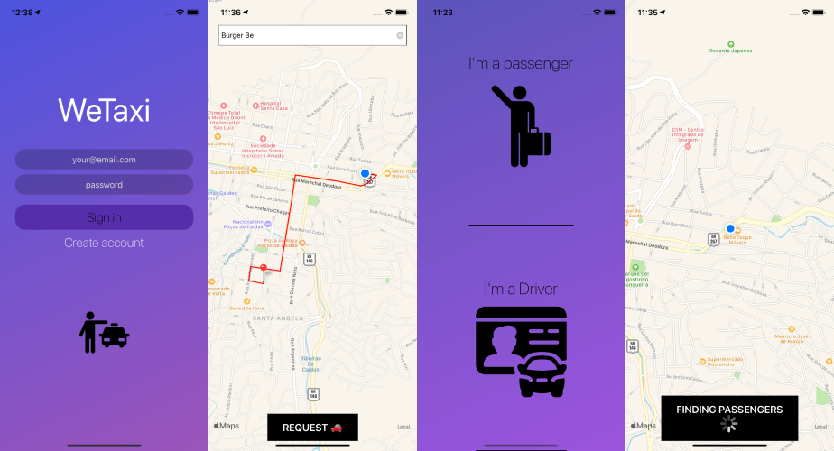
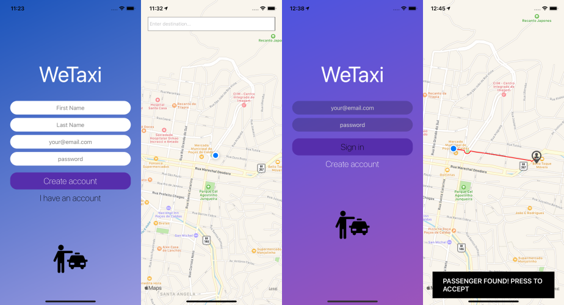
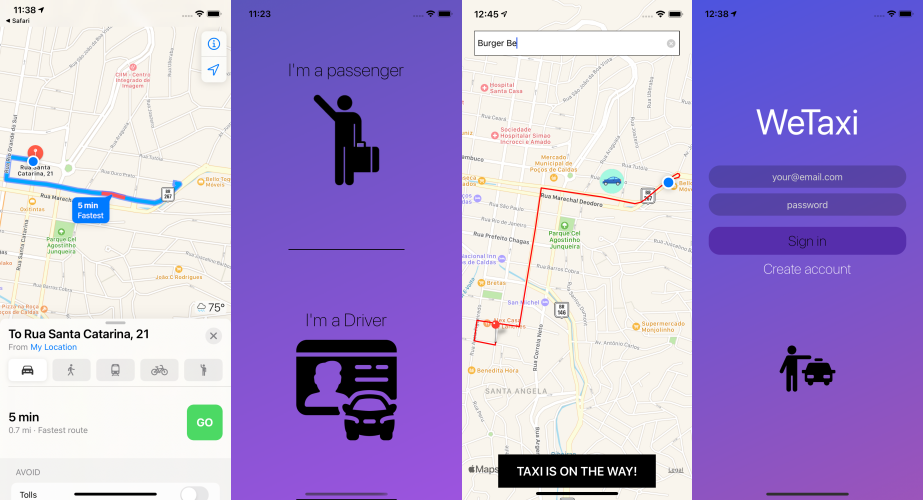

# WeTaxi 
A React-Native App that links Taxi Drivers and Passengers. It was built for studies purposes... 


It uses a [Socket.io Server](https://github.com/daniel30-07/taxi-app-socket.io) to connect Driver and Passenger in real time. It also uses a REST API [Express Backend](https://github.com/daniel30-07/taxi-app-express-backend.git) for login, sign up, authentication and controlling routes inside the App.  

video of the application running:
https://streamable.com/jb8wyo

<em>Due to recent background location permissions change on Android, the app is working properly on IOS only.

If you want to implement it on android, you must make adjustments and request background permission directly with Google Developer:</em>
https://support.google.com/googleplay/android-developer/answer/9799150?hl=en

 

## Functionalities
* Sign up / Login / Authentication
* Passenger type a location on the search box and the app will determine and trace the route on the Google Map Api.
* Taxi Driver will receive Passenger's location and trace the route, choosing to accept the ride and going to Navigation
* If a Taxi Driver accept the ride, the Passenger receives a notification and Driver's background location to watch the trip.

## Tech/framework used
* React-native
* Express
* Socket.io
* Mongodb
* Google Maps Api

## Installation - yarn
### Prerequisites
To run this project in the development mode, you'll need to have a basic environment to run a React-Native App, that can be found [here](https://reactnative.dev/docs/environment-setup).

Also, you'll need to the servers running locally on your machine with the mock data. You can find the [Socket.io Server here](https://github.com/daniel30-07/taxi-app-socket.io). and the [Express Server here](https://github.com/daniel30-07/taxi-app-express-backend.git)

### Installing
Cloning the Repository

```
$ git clone https://github.com/crazynavi/taxi-app.git
```

```
$ yarn
```
or
```
$ npm install
```

#### For IOS development

```
sudo gem install cocoapods

cd ios && pod install
```

#### For ANDROID develpment

Go to file:
/node_modules/@mauron85/react-native-background-geolocation/android/common/gradle.properties
And set:
```
android.enableUnitTestBinaryResources=false
```
from terminal
```
npx jetify
```

## Running
With all dependencies installed and the environment properly configured, you can now run the app.

* For the first time, run the app on Xcode or Android Studio and after that:

#### Android
```
$ yarn android
```
#### iOS
```
$ yarn ios
```

## Connecting the App with Servers

1 - Follow the instructions on the taxi-app-socket.io and taxi-app-express to have the server running on your machine.

2 - With the server up and running, go to the ./baseUrl.js file and edit the value of the field baseURL and socketIoURL with the IP of your machine.


## Built With

- [React-Native](https://facebook.github.io/react-native/) - Build the native app using JavaScript and React
- [React-Navigation](https://reactnavigation.org/docs/en/getting-started.html) - Router
- [React-Native-Maps](https://github.com/react-native-maps/react-native-maps) - React Native Map components
- [Socket.io](https://www.npmjs.com/package/socket.io) - Enables real-time bidirectional event-based communication
- [Axios](https://github.com/axios/axios) - HTTP Client
- [ESlint](https://eslint.org/) - Linter
- [@mapbox/polyline](https://www.npmjs.com/package/@mapbox/polyline) - A simple google-esque polyline implementation in Javascript
- [Lodash](https://www.npmjs.com/package/lodash) - The Lodash library exported as Node.js modules
- [Prettier](https://prettier.io/) - Code Formatter
- [Babel](https://babeljs.io/) - JavaScript Compiler
- [@mauron85](https://www.npmjs.com/package/@mauron85/react-native-background-geolocation) - React-native background geolocation
- [React-Native-Linear-Gradient](https://github.com/react-native-community/react-native-linear-gradient) - Gradient Styles

## Contributing

You can send how many PR's do you want, I'll be glad to analyse and accept them! And if you have any question about the project...

Email-me: ilove.delicious.pizza@gmail.com


Thank you!





